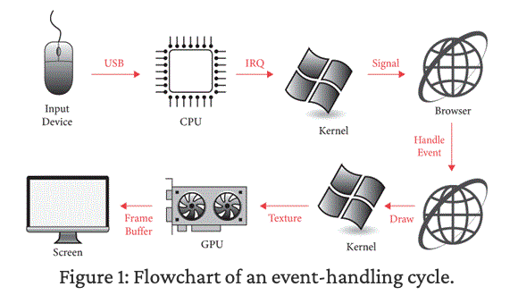
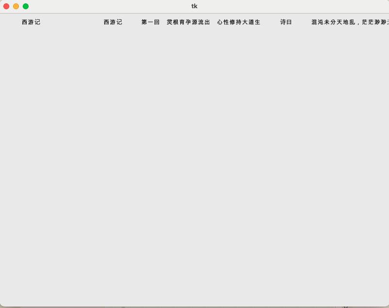
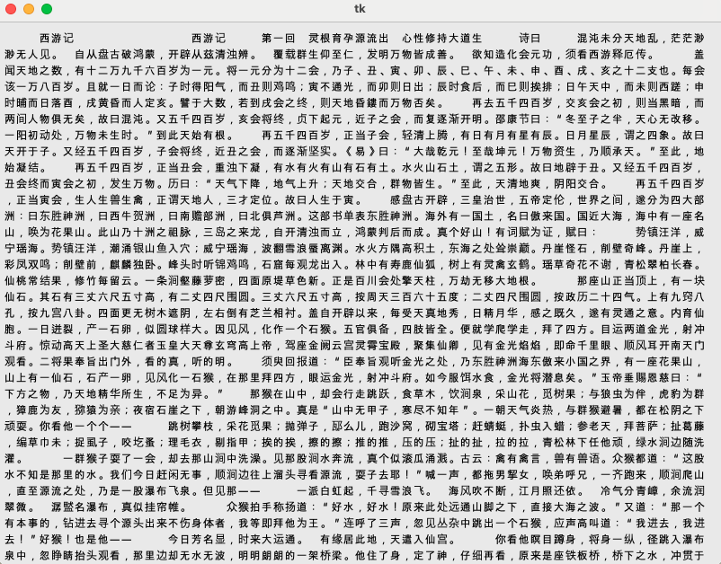

# 1부. 페이지 로딩

# 1장. 웹페이지 다운로드

## 1.1 서버에 연결하기

**URL**

**URL**은 "uniform resource locator"의 약자다. URL을 통해 브라우저가 방문해야 할 특정 웹페이지를 식별할 수 있다.

```
http://example.org/index.html

{scheme}://{hostname}{path}
```

URL은 다음과 같은 세 부분으로 나뉜다.

- **Scheme (스키마):** 정보에 **어떻게** 접근할지 설명한다. 예를 들어, `http`나 `https`가 있다.
- **Host Name (호스트 이름):** 정보를 **어디서** 얻을지 설명한다.
- **Path (경로):** **어떤** 정보를 얻을지 설명한다.

**웹페이지 다운로드 과정**

1. 브라우저가 운영체제에 호스트 이름에 해당하는 서버와 연결시켜 달라고 요청
2. 운영체제가 DNS 서버와 `example.org`와 같은 호스트 이름을 `93.184.216.34`와 같은 **목적지 IP 주소**로 변환
3. 운영체제가 라우팅 테이블을 사용해 해당 IP 주소와 통신하기에 가장 적합한 장치(스위치, 엑세트 포인트, 라우터 등)를 결정하고 전선이나 무선을 통해 신호를 보냄
4. 라우터들이 신호를 감지하고 메세지를 전달하기 위한 최적의 다음 라우터로 전송함
5. 일련의 라우터들을 거쳐서 목적지에 도착
6. 메세지가 서버에 도착하면 해당 서버와의 연결이 이루어짐

실제로 서버와의 연결을 확인하기 위해서는 `telnet`을 사용하면 된다.

```bash
telnet example.org 80

> Trying 23.215.0.133...
Connected to example.org.
Escape character is '^]'.
```

```bash
nc -v example.org 80
> Connection to example.org port 80 [tcp/http] succeeded!
```

## 1.2 정보 요청하기

서버에 연결 후 브라우저는 `/index.html`과 같이 URL의 경로에 해당하는 정보를 요청한다.

다음과 같이 구현해 볼 수 있다.

- GET 메서드를 통해 서버에 정보를 요청
- 경로 `/index.html` 명시
- 사용 중인 프로토콜 HTTP/1.0 명시
- HTTP 헤더 `Host` 명시

```bash
GET /index.html HTTP/1.0
Host: example.org

# 엔터 두 번을 누르면 요청이 전송됨
```

## 1.3 서버의 응답

서버 응답의 첫 줄은 다음과 같다.

```bash
HTTP/1.0 200 OK
```

- 호스트가 HTTP/1.0으로 응답하고 있다.
- 요청에 대해 OK로 확인했다.

그리고 그 뒤에 서버가 헤더를 보낸다.

```bash
Content-Type: text/html
ETag: "bc2473a18e003bdb249eba5ce893033f:1760028122.592274"
Last-Modified: Thu, 09 Oct 2025 16:42:02 GMT
Cache-Control: max-age=86000
Date: Sun, 02 Nov 2025 07:08:48 GMT
Content-Length: 513
Connection: close
X-N: S
```

그 뒤에 빈 줄이 있고, 그 뒤에 서버 응답의 바디가 이어진다.

- `Content-Type`의 값이 `text/html`이므로 바디가 HTML임을 알 수 있다.

```bash
<!doctype html><html lang="en"><head><title>Example Domain</title><meta name="viewport" content="width=device-width, initial-scale=1"><style>body{background:#eee;width:60vw;margin:15vh auto;font-family:system-ui,sans-serif}h1{font-size:1.5em}div{opacity:0.8}a:link,a:visited{color:#348}</style><body><div><h1>Example Domain</h1><p>This domain is for use in documentation examples without needing permission. Avoid use in operations.<p><a href="https://iana.org/domains/example">Learn more</a></div></body></html>
```

## 1.4 파이썬을 통한 텔넷

실제 telnet처럼 동작하는 프로그램을 만들어 보려 한다.

- URL에서 호스트 이름과 경로를 추출
- 소켓을 생성
- 요청을 보냄
- 응답을 수신

**URL 파싱**

**스킴 처리**

```python
class URL:
  def __init__(self, url):
    self.scheme, url = url.split("://", 1)
    assert self.scheme == "http" # 일단 http만 지원하도록 함
```

**호스트와 경로 분리**

```python
class URL:
  def __init__(self, url):
    #...
    if "/" not in url:
      url = url + "/"
    self.host, url = url.split("/", 1)
    self.path = "/" + url
```

**request 메서드 추가**

다른 컴퓨터와 소통하기 위해 소켓을 만들어야 한다. 이 소켓은 다음과 같은 요소들을 사용하여 다른 컴퓨터와 정보를 주고받을 수 있다.

- **주소 패밀리 address family**: 다른 컴퓨터를 찾는 방법을 알려준다.
  - `AF`로 시작한다.
- **타입**: 어떤 종류의 대화가 이루어질지 설명하는 역할을 한다.
  - 소켓의 타입은 `SOCK`으로 시작한다. 일단 각 컴퓨터가 임의의 양의 데이터를 전송할 수 있는 `SOCK_STREAM`을 사용한다. 혹은 고정된 크기의 패킷만 전송할 수 있는 `SOCK_DGRAM`도 존재한다.
- **프로토콜**: 두 컴퓨터가 연결을 설정하는 단계를 의미한다.

```python
import socket

class URL:
  def __init__(self, url):
    #...
  def request(self):
    # 소켓 생성
    s = socket.socket(
      family=socket.AF_INET,
      type=socket.SOCK_STREAM,
      proto=socket.IPPROTO_TCP,
    )

    # 소켓 연결
    s.connect((self.host, 80))
```

## 1.5 요청과 응답

**send 메서드**

서버에 데이터를 전송하기 위한 메서드이다.

```python
class URL:
  def request(self):
    #...
    request = "GET {} HTTP/1.0\r\n".format(self.path)
    request += "Host: {}\r\n".format(self.host) # 줄바꿈을 위해 \r이 아니라 \r\n을 사용해야 한다.
    request += "\r\n" # 무조건 \r\n을 두번 보내야 한다.
```

**encode 호출**

`encode`를 사용하여 텍스트를 바이트로 변환하고 `decode`를 사용하여 바이트를 텍스트로 변환한다.

```python
class URL:
  def request(self):
    #...
    request = "GET {} HTTP/1.0\r\n".format(self.path)
    request += "Host: {}\r\n".format(self.host) # 줄바꿈을 위해 \r이 아니라 \r\n을 사용해야 한다.
    request += "\r\n" # 무조건 \r\n을 두번 보내야 한다.
    s.send(request.encode("utf-8"))
```

**makefile 사용**

서버의 응답을 읽기 위해서 소켓의 `read` 메서드를 활용한다. 이 때 데이터가 도착할 때마다 서버의 응답을 수집해야 하는데, 데이터가 도착하는 대로 비트를 수집하기 위해 `read` 함수를 호출하는 루프 문을 작성해야 한다. 파이썬의 `makefile` 함수를 사용하면 이 반복 작업을 생략하고 숨길 수 있다.

`makefile`은 서버로부터 받은 모든 바이트가 포함된 파일 형식의 객체를 반환한다. 이 바이트를 `utf8` 인코딩을 사용하는 문자열로 변환하면서 HTTP의 줄바꿈을 `\r\n`이라고 알려주어서 제대로 응답 데이터를 파싱하도록 도와주는 인자도 추가한다.

```python
class URL:
  def request(self):
    #...
    # 응답 수신
    response = s.makefile("r", encoding="utf-8", newline="\r\n") # HTTP의 줄바꿈은 \r\n 이므로 newline="\r\n" 으로 지정
```

**상태 라인 읽기**

```python
class URL:
  def request(self):
    #...
		# 상태 라인 읽기
    statusline = response.readline() # 상태 라인 읽기
    version, status, explanation = statusline.split(" ", 2) # 상태 라인 파싱
```

**헤더 읽기**

```python
class URL:
  def request(self):
    #...
    # 헤더 읽기
    response_headers = {}
    while True:
      line = response.readline()
      if line == "\r\n": # 헤더의 끝은 빈 줄로 표시된다.
        break
      header, value = line.split(":", 1)
      response_headers[header.casefold()] = value.strip() # 헤더 이름은 대소문자를 구분하지 않으므로 casefold() 사용하여 소문자로 통일
```

여기에 주요한 헤더들의 유무를 체크하는 코드를 넣어보자.

- `transfer-encoding` : 클라이언트와 서버 사이에서 데이터를 전송할 때 어떻게 인코딩되어 전달되는지를 나타내는 헤더. 쪼개서 보내거나(`chunked`), 압축했거나(`compress`, `gzip`, `deflate` 등)
- `content-encoding` : 서버에서 데이터를 전송하기 전에 어떻게 압축했는지를 나타내는 헤더(`gzip`, `br`, `deflate` 등)

```python
class URL:
  def request(self):
    #...
    # 헤더 읽기
    assert "transfer-encoding" not in response_headers
    assert "content-encoding" not in response_headers
```

**본문 읽기**

일반적으로 헤더 다음의 모든 내용들이 바로 본문에 해당된다.

```python
class URL:
  def request(self):
    #...
		# 본문 읽기
    body = response.read()
    s.close() # 소켓 닫기
    return body
```

## 1.6 HTML 표시하기

**HTML의 텍스트 출력하기**

태그는 콘텐츠의 정보를 표시하고 텍스트는 실제 콘텐츠를 나타내니, 일단 태그를 제외한 페이지의 모든 텍스트를 출력해본다.

```python
def show(body):
  in_tag = False
  for c in body:
    if c == "<":
      in_tag = True
    elif c == ">":
      in_tag = False
    elif not in_tag:
      print(c, end="") # 태그 안에 있지 않은 문자만 출력
```

이제 `request`와 `show`를 사용하면 웹페이지를 로드할 수 있게 된다.

```python
# 웹페이지 로드
def load(url):
  body = url.request()
  show(body)
```

커맨드 라인에서 이 스크립트를 실행하는 코드를 추가하자

```bash
# 커맨드 라인에서 실행할 때 load 함수 실행
if __name__ == "__main__":
  import sys
  load(URL(sys.argv[1])) # 커맨드 라인 인수를 URL 객체로 변환하여 load 함수에 전달
```

이제 다음과 같이 내가 로드하고 싶은 웹페이지 주소를 가지고 스크립트를 실행하면 해당 페이지의 텍스트들을 불러올 수 있다.

```bash
$python3 browser.py http://example.org

> Example Domainbody{background:#eee;width:60vw;margin:15vh auto;font-family:system-ui,sans-serif}h1{font-size:1.5em}div{opacity:0.8}a:link,a:visited{color:#348}Example DomainThis domain is for use in documentation examples without needing permission. Avoid use in operations.Learn more
```

## 1.7 암호화된 연결

**https 연결하기**

브라우저와 호스트 간 모든 통신이 평문화된 http 대신 https 스킴을 사용하여 암호화된 연결을 만들어보자. 이는 파이썬의 ssl 라이브러리를 사용하면 간단하게 만들 수 있다.

소켓을 생성한 뒤 ssl 라이브러리를 사용하여 소켓을 감싼다.

```python
import ssl

class URL:
  def __init__(self, url):
    self.scheme, url = url.split("://", 1)
    # https를 스킴에 추가
    assert self.scheme in ["http", "https"]

    if "/" not in url:
      url = url + "/"
	    self.host, url = url.split("/", 1)
	    self.path = "/" + url

    # 연결에 따른 포트 지정
    if self.scheme == "http":
      self.port = 80
    elif self.scheme == "https":
      self.port = 443

  def request(self):
    # 소켓 생성
    s = socket.socket(
      #...
    )

    s.connect((self.host, self.port))

		# https ssl 통신을 위해 소켓을 감싸기
    if self.scheme == "https":
      ctx = ssl.create_default_context()
      s = ctx.wrap_socket(s, server_hostname=self.host)
```

**사용자 지정 포트 지원 추가하기**

만약 URL에 포트가 있다면, 해당 포트를 파싱해서 사용하도록 만들자

```python
http://example.org:8080/index.html
```

```python
class URL:
  def __init__(self, url):
    self.scheme, url = url.split("://", 1)
    assert self.scheme in ["http", "https"]

    if "/" not in url:
      url = url + "/"
    self.host, url = url.split("/", 1)
    self.path = "/" + url

    if self.scheme == "http":
      self.port = 80
    elif self.scheme == "https":
      self.port = 443

		# 사용자 지정 포트 파싱하기
    if ":" in self.host:
      self.host, port = self.host.split(":", 1)
      self.port = int(port)
```

# 2장. 화면에 그리기

브라우저는 웹페이지를 다운로드하고 사용자에게 보여주어야 하므로 그래픽 어플리케이션이어야 한다.

## 2.1 창 만들기

**창(windows), 버튼(buttons), 그리고 마우스**와 같이 데스크톱 및 랩톱 컴퓨터에서 운영 체제(OS)가 제공하는 그래픽 사용자 인터페이스 요소들을 **데스크톱 환경(desktop environment)**이라 한다. 프로그램은 자신의 창을 제어하지만, 데스크톱 환경은 화면 전체를 제어하는 식으로 역할 분담이 발생한다. 예를 들어

- **창 표시:** 프로그램이 새로운 창을 요청하면, **데스크톱 환경이 실제로 그 창을 화면에 표시**
- **화면 출력:** 프로그램이 자신의 창 내부에 그림을 그리거나 내용을 출력하면, **데스크톱 환경이 그 내용을 화면에 배치**
- **이벤트 전달:** **데스크톱 환경**은 마우스 클릭이나 키 입력과 같은 이벤트들을 프로그램에 전달하고, 프로그램은 이 이벤트에 반응하여 상태를 업데이트하고 창을 다시 그림

대부분의 프로그램들은 이런 단계를 단순화하기 위해 그래픽 툴킷을 사용한다. Python에는 tkinter 패키지에 포함된 `Tk`라는 크래픽 툴킷이 있다.

```python
import tkinter
window = tkinter.Tk()
tkinter.mainloop()
```

tkinter.mainloop() 함수는 이벤트 루프를 시작하는 함수이다. 아래와 같은 루프가 돌아간다고 생각하면 된다. 

```python
while True:
  for evt in pendingEvents():
    handleEvent(evt)
  drawScreen()
```



- `pendingEvent`를 사용하여 데스크톱 환경에 쌓여 있는 최근 이벤트(마우스 클릭이나 키 입력 등)를 얻고
- `handleEvent`를 사용하여 어플리케이션의 상태를 업데이트하고
- `drawScreen`을 사용하여 창을 다시 그린다.

결국 **복잡한 어플리케이션은 모든 이벤트를 처리하고 최종적으로 화면을 업데이트해야 하므로**, 웹 브라우저뿐만 아니라 비디오 게임 등 많은 그래픽 어플리케이션에서 이벤트 루프를 활용한다.

## 2.2 창에 그리기

실습으로 만들 브라우저는 캔버스라고 하는 TkWidget에 웹페이지를 그린다. Tk를 사용하면 다음과 같이 캔버스를 만들 수 있다.

```python
WIDTH, HEIGTH = 800, 600 # 흔히 사용하는 모니터 크기

# 창을 생성하기
window.tkinter.Tk() 

# 창에 대한 Canvas 생성
# 창 객체 window를 전달하여 Tk에 캔버스를 어디에 표시해야 할지를 알려줌
canvas = tkinter.Canvas(window, width=WIDTH, height=HEIGHT) 

# 캔버스를 실제로 창에 배치
canvas.pack()
```

Browser 클래스 안으로 위의 로직을 넣어 캔버스를 만들자

```python
WIDTH, HEIGHT = 800, 600

class Browser: 
  def __init__(self):
    self.window = tkinter.Tk()
    self.canvas = tkinter.Canvas(
	    self.window, 
	    width=WIDTH, 
	    height=HEIGHT
    )
    self.canvas.pack()
```

이제 만들어진 캔버스 위에 도형을 그리는 메서드를 호출하자. 일단 새로 만든 `Browser` 클래스 안으로 load 함수를 옮겨 메서드로 만들고 도형들을 그려본다.

```python
class Browser:
  def load(self, url):
    #...

    self.canvas.create_rectangle(10, 20, 400, 300)
    self.canvas.create_oval(100, 100, 150, 150)
    self.canvas.create_text(200, 150, text="Hi there!")
```

이 코드를 테스트해 보자. `Browser` 객체를 만들고 `load`를 호출한 다음, Tk의 `mainloop`를 호출한다.

```python
if __name__ == "__main__":
  import sys
  Browser().load(URL(sys.argv[1]))
  tkinter.mainloop()
```

커맨드 라인에서 실행하자.

```python
python3 <파일명>.py https://example.org
```

다음과 같이 Tk 창이 뜨면서 캔버스에 그린 도형들이 출력된다.


## 2.3 텍스트 배치하기

웹페이지 소스 코드를 콘솔이 아니라 캔버스에 출력하려 한다. `show` 함수를 `lex`(`lexer`, 낱말 분석)로 이름을 바꾸고 HTML 문서의 텍스트를 출력이 아니라 반환하도록 변경한다.

```python
def lex(body):
  text = ""
  in_tag = False
  for c in body:
    if c == "<":
      in_tag = True
    elif c == ">":
      in_tag = False
    elif not in_tag:
      text += c
  return text
```

이제 `load` 함수가 `text`에 저장된 문자열을 한 글자씩 그린다.

```python
class Browser: 
  def load(self, url):
    body = url.request()
    text = lex(body)
    
    for c in text:
      self.canvas.create_text(100, 100, text=c)
```

이제 이 코드를 실제로 테스트해 보면(테스트 URL: https://browser.engineering/examples/xiyouji.html), 모든 글자가 같은 위치에 그려져 겹쳐 보이는 문제가 생긴다. 


이를 해결하기 위해서 `cursor_x`와 `cursor_y` 변수를 만들어서 마치 문서 편집기의 커서와 같이 다음 문자가 들어갈 위치를 가리키게 한다. 이렇게 되면 텍스트가 왼쪽에서 오른쪽으로 한 줄로 출력된다.



```python
HSTEP, VSTEP = 13, 18
cursor_x, cursor_y = HSTEP, VSTEP
for c in text:
      self.canvas.create_text(cursor_x, cursor_y, text=c)
      cursor_x += HSTEP
```

이제 화면 가장자리에 도달했을 때 줄을 바꾼다.

```python
  def load(self, url):
    #...
    for c in text:
      self.canvas.create_text(cursor_x, cursor_y, text=c)
      cursor_x += HSTEP
      
      # 줄 바꿈 처리
      if cursor_x >= WIDTH - HSTEP:
        cursor_y += VSTEP
        cursor_x = HSTEP
```



하지만 텍스트의 많은 부분이 화면 안에 들어가지 않는다. 즉, 화면 스크롤을 구현해야 한다.

## 2.4 텍스트 스크롤하기


스크롤 기능을 위해서는 위와 같이 **페이지 좌표계**와 **화면의 좌표계** 사이에 레이어 개념이 필요하다. 일반적으로 브라우저는 **페이지 좌표계로 페이지를 레이아웃**(layout, 페이지의 모든 요소가 어디에 있어야 하는지를 결정하는 것)한 뒤 **화면 좌표계로 페이지를 렌더링**한다.

지금 실습 코드는 `load` 함수에서 레이아웃과 렌더링을 모두 하고 있으므로, 이 함수를

- 각 문자의 위치를 계산하여 저장하는 `layout` 함수 → **페이지 좌표계 담당**
- 위치를 기반으로 각 문자를 그리는 `draw` 함수 → **화면 좌표계 담당**

으로 나누는 것이 핵심이다.

### layout 함수

각 문자에 대해 `canvas.create_text`를 호출하는 대신 해당 문자를 위치와 함께 **디스플레이 리스트 display list(화면에 그려야 할 요소들의 집합)**에 추가한다.

레이아웃(layout) 함수는 **페이지 좌표(page coordinates)**를 기준으로 콘텐츠의 위치를 계산하는 역할만 수행한다. 화면 표시나 상호 작용과 관련된 정보를 분리했으므로 `Browser` 객체의 어떤 것도 액세스할 필요가 없어, 독립적인 함수로 만들 수 있다.

```python
def layout(text):
	# 화면에 그려야 할 요소들의 집합
  display_list = []

  cursor_x, cursor_y = HSTEP, VSTEP
  for c in text:
    display_list.append((cursor_x, cursor_y, c))
    cursor_x += HSTEP

    # 줄 바꿈 처리
    if cursor_x >= WIDTH - HSTEP:
      cursor_y += VSTEP
      cursor_x = HSTEP
  
  return display_list
```

### draw 함수

`draw`는 루프를 돌리며 각 문자를 그리는 역할을 한다. 이를 위해서는 캔버스에 접근해야 하므로 `Browser` 객체의 메서드로 처리한다. 

```python
class Browser: 
  def draw(self):
    for x, y, c in self.display_list:
      self.canvas.create_text(x, y, text=c)
```

### load 수정

이제 `load` 함수에서 `layout`과 `draw`를 호출한다.

```python
class Browser:
  def load(self, url):
    body = url.request()
    text = lex(body)
    self.display_list = layout(text)
    self.draw()
```

### 스크롤 추가

스크롤한 거리를 나타내는 변수를 추가하고

```python
class Browser: 
  def __init__(self):
    #...

    # 스크롤
    self.scroll = 0 # 스크롤한 거리
```

`draw` 함수에서 화면 좌표계의 높이를 적용하기 위해 `y`를 `y - self.scroll` 값으로 바꾼다.

```python
  def draw(self):
    for x, y, c in self.display_list:
      self.canvas.create_text(x, y - self.scroll, text=c)
```

이제 scroll 값을 바꾸면 페이지가 위아래로 스크롤될 것이다. 

사용자가 scroll을 바꿀 수 있도록, 일단 아래 화살표 키를 눌렀을 때 함수가 호출되도록 하자. 이를 위해 Tk의 **바인딩(bind)**을 사용한다.

```python
class Browser: 
  def __init__(self):
	  #...
    self.window.bind("<Down>", self.scrolldown)
	
  def draw(self):
    self.canvas.delete("all") # 캔버스 초기화
    #...
  
  # 아래로 스크롤 이벤트 핸들러
  def scrolldown(self, e):
    self.scroll += SCROLL_STEP
    self.draw()
```

이제 아래 화살표 키를 눌렀을 때 스크롤이 일어난다!

## 2.5 더 빠른 렌더링

브라우저와 같은 그래픽 어플리케이션은 

- **프레임 레이트(frame rate, 화면의 갱신 속도)를 정확히 60Hz 이내**에 다시 그리는 것을 목표로 한다.
- 따라서 브라우저는 모든 작업을 60분의 1초, 즉 16ms 이내에 완료해야 한다.
- 이런 **16ms**를 애플리케이션의 **애니메이션 프레임 버짓 animation frame budget**이라 한다.

하지만 `create_text` 안에서 문자에 대한 정보를 로드하는 데 시간이 소요되므로 스크롤은 느릴 수밖에 없다. 따라서 스크롤의 속도를 높이기 위해 **문자가 꼭 화면에 있는 경우에만 그리도록** 변경한다.

```python
def draw(self):
    self.canvas.delete("all") # 캔버스 초기화
    for x, y, c in self.display_list:
      # 보이지 않는 부분은 그리지 않음
      if y > self.scroll + HEIGHT: continue # 창의 아래 부분
      if y + VSTEP < self.scroll: continue # 창의 위의 부분
      
      # 그리기
      self.canvas.create_text(x, y - self.scroll, text=c)
```

중요한 포인트는, 우리가 `draw`와 `layout`을 분리했으므로 이 최적화를 구현하기 위해서는 **layout을 전혀 변경하지 않아도 된다**는 것이다.