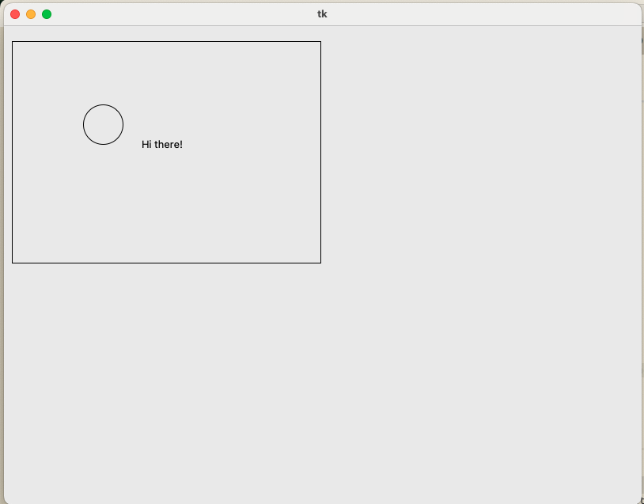
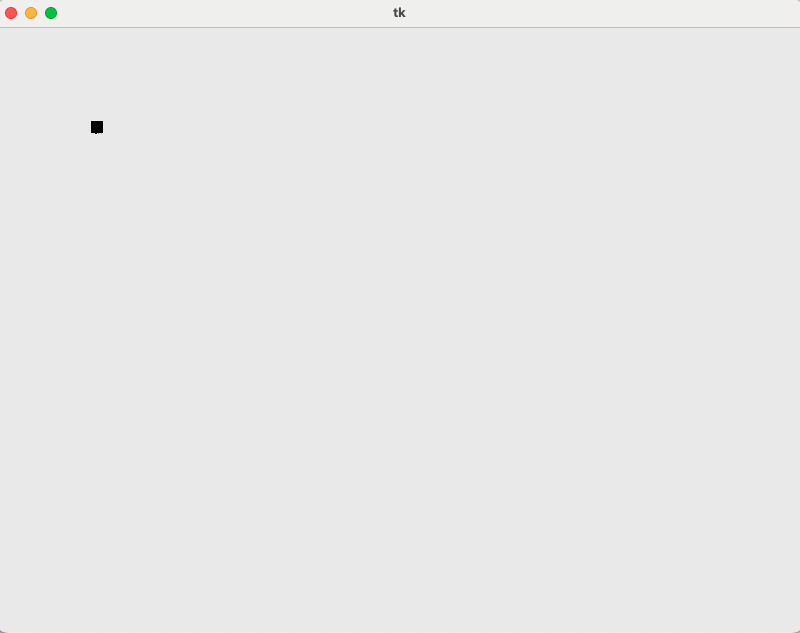
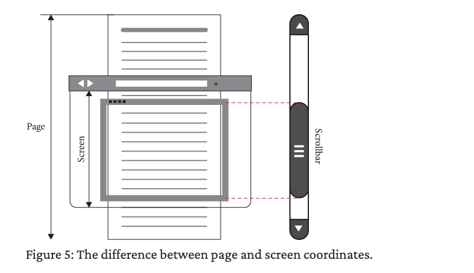

# 2장. 화면에 그리기

브라우저는 웹페이지를 다운로드하고 사용자에게 보여주어야 하므로 그래픽 어플리케이션이어야 한다.

## 2.1 창 만들기

**창(windows), 버튼(buttons), 그리고 마우스**와 같이 데스크톱 및 랩톱 컴퓨터에서 운영 체제(OS)가 제공하는 그래픽 사용자 인터페이스 요소들을 **데스크톱 환경(desktop environment)**이라 한다. 프로그램은 자신의 창을 제어하지만, 데스크톱 환경은 화면 전체를 제어하는 식으로 역할 분담이 발생한다. 예를 들어

- **창 표시:** 프로그램이 새로운 창을 요청하면, **데스크톱 환경이 실제로 그 창을 화면에 표시**
- **화면 출력:** 프로그램이 자신의 창 내부에 그림을 그리거나 내용을 출력하면, **데스크톱 환경이 그 내용을 화면에 배치**
- **이벤트 전달:** **데스크톱 환경**은 마우스 클릭이나 키 입력과 같은 이벤트들을 프로그램에 전달하고, 프로그램은 이 이벤트에 반응하여 상태를 업데이트하고 창을 다시 그림

대부분의 프로그램들은 이런 단계를 단순화하기 위해 그래픽 툴킷을 사용한다. Python에는 tkinter 패키지에 포함된 `Tk`라는 크래픽 툴킷이 있다.

```python
import tkinter
window = tkinter.Tk()
tkinter.mainloop()
```

tkinter.mainloop() 함수는 이벤트 루프를 시작하는 함수이다. 아래와 같은 루프가 돌아간다고 생각하면 된다.

```python
while True:
  for evt in pendingEvents():
    handleEvent(evt)
  drawScreen()
```


- `pendingEvent`를 사용하여 데스크톱 환경에 쌓여 있는 최근 이벤트(마우스 클릭이나 키 입력 등)를 얻고
- `handleEvent`를 사용하여 어플리케이션의 상태를 업데이트하고
- `drawScreen`을 사용하여 창을 다시 그린다.

결국 **복잡한 어플리케이션은 모든 이벤트를 처리하고 최종적으로 화면을 업데이트해야 하므로**, 웹 브라우저뿐만 아니라 비디오 게임 등 많은 그래픽 어플리케이션에서 이벤트 루프를 활용한다.

## 2.2 창에 그리기

실습으로 만들 브라우저는 캔버스라고 하는 TkWidget에 웹페이지를 그린다. Tk를 사용하면 다음과 같이 캔버스를 만들 수 있다.

```python
WIDTH, HEIGTH = 800, 600 # 흔히 사용하는 모니터 크기

# 창을 생성하기
window.tkinter.Tk()

# 창에 대한 Canvas 생성
# 창 객체 window를 전달하여 Tk에 캔버스를 어디에 표시해야 할지를 알려줌
canvas = tkinter.Canvas(window, width=WIDTH, height=HEIGHT)

# 캔버스를 실제로 창에 배치
canvas.pack()
```

Browser 클래스 안으로 위의 로직을 넣어 캔버스를 만들자

```python
WIDTH, HEIGHT = 800, 600

class Browser:
  def __init__(self):
    self.window = tkinter.Tk()
    self.canvas = tkinter.Canvas(
	    self.window,
	    width=WIDTH,
	    height=HEIGHT
    )
    self.canvas.pack()
```

이제 만들어진 캔버스 위에 도형을 그리는 메서드를 호출하자. 일단 새로 만든 `Browser` 클래스 안으로 load 함수를 옮겨 메서드로 만들고 도형들을 그려본다.

```python
class Browser:
  def load(self, url):
    #...

    self.canvas.create_rectangle(10, 20, 400, 300)
    self.canvas.create_oval(100, 100, 150, 150)
    self.canvas.create_text(200, 150, text="Hi there!")
```

이 코드를 테스트해 보자. `Browser` 객체를 만들고 `load`를 호출한 다음, Tk의 `mainloop`를 호출한다.

```python
if __name__ == "__main__":
  import sys
  Browser().load(URL(sys.argv[1]))
  tkinter.mainloop()
```

커맨드 라인에서 실행하자.

```python
python3 <파일명>.py https://example.org
```

다음과 같이 Tk 창이 뜨면서 캔버스에 그린 도형들이 출력된다.



## 2.3 텍스트 배치하기

웹페이지 소스 코드를 콘솔이 아니라 캔버스에 출력하려 한다. `show` 함수를 `lex`(`lexer`, 낱말 분석)로 이름을 바꾸고 HTML 문서의 텍스트를 출력이 아니라 반환하도록 변경한다.

```python
def lex(body):
  text = ""
  in_tag = False
  for c in body:
    if c == "<":
      in_tag = True
    elif c == ">":
      in_tag = False
    elif not in_tag:
      text += c
  return text
```

이제 `load` 함수가 `text`에 저장된 문자열을 한 글자씩 그린다.

```python
class Browser:
  def load(self, url):
    body = url.request()
    text = lex(body)

    for c in text:
      self.canvas.create_text(100, 100, text=c)
```

이제 이 코드를 실제로 테스트해 보면(테스트 URL: https://browser.engineering/examples/xiyouji.html), 모든 글자가 같은 위치에 그려져 겹쳐 보이는 문제가 생긴다.



이를 해결하기 위해서 `cursor_x`와 `cursor_y` 변수를 만들어서 마치 문서 편집기의 커서와 같이 다음 문자가 들어갈 위치를 가리키게 한다. 이렇게 되면 텍스트가 왼쪽에서 오른쪽으로 한 줄로 출력된다.


```python
HSTEP, VSTEP = 13, 18
cursor_x, cursor_y = HSTEP, VSTEP
for c in text:
      self.canvas.create_text(cursor_x, cursor_y, text=c)
      cursor_x += HSTEP
```

이제 화면 가장자리에 도달했을 때 줄을 바꾼다.

```python
  def load(self, url):
    #...
    for c in text:
      self.canvas.create_text(cursor_x, cursor_y, text=c)
      cursor_x += HSTEP

      # 줄 바꿈 처리
      if cursor_x >= WIDTH - HSTEP:
        cursor_y += VSTEP
        cursor_x = HSTEP
```


하지만 텍스트의 많은 부분이 화면 안에 들어가지 않는다. 즉, 화면 스크롤을 구현해야 한다.

## 2.4 텍스트 스크롤하기



스크롤 기능을 위해서는 위와 같이 **페이지 좌표계**와 **화면의 좌표계** 사이에 레이어 개념이 필요하다. 일반적으로 브라우저는 **페이지 좌표계로 페이지를 레이아웃**(layout, 페이지의 모든 요소가 어디에 있어야 하는지를 결정하는 것)한 뒤 **화면 좌표계로 페이지를 렌더링**한다.

지금 실습 코드는 `load` 함수에서 레이아웃과 렌더링을 모두 하고 있으므로, 이 함수를

- 각 문자의 위치를 계산하여 저장하는 `layout` 함수 → **페이지 좌표계 담당**
- 위치를 기반으로 각 문자를 그리는 `draw` 함수 → **화면 좌표계 담당**

으로 나누는 것이 핵심이다.

### layout 함수

각 문자에 대해 `canvas.create_text`를 호출하는 대신 해당 문자를 위치와 함께 **디스플레이 리스트 display list(화면에 그려야 할 요소들의 집합)**에 추가한다.

레이아웃(layout) 함수는 **페이지 좌표(page coordinates)**를 기준으로 콘텐츠의 위치를 계산하는 역할만 수행한다. 화면 표시나 상호 작용과 관련된 정보를 분리했으므로 `Browser` 객체의 어떤 것도 액세스할 필요가 없어, 독립적인 함수로 만들 수 있다.

```python
def layout(text):
	# 화면에 그려야 할 요소들의 집합
  display_list = []

  cursor_x, cursor_y = HSTEP, VSTEP
  for c in text:
    display_list.append((cursor_x, cursor_y, c))
    cursor_x += HSTEP

    # 줄 바꿈 처리
    if cursor_x >= WIDTH - HSTEP:
      cursor_y += VSTEP
      cursor_x = HSTEP

  return display_list
```

### draw 함수

`draw`는 루프를 돌리며 각 문자를 그리는 역할을 한다. 이를 위해서는 캔버스에 접근해야 하므로 `Browser` 객체의 메서드로 처리한다.

```python
class Browser:
  def draw(self):
    for x, y, c in self.display_list:
      self.canvas.create_text(x, y, text=c)
```

### load 수정

이제 `load` 함수에서 `layout`과 `draw`를 호출한다.

```python
class Browser:
  def load(self, url):
    body = url.request()
    text = lex(body)
    self.display_list = layout(text)
    self.draw()
```

### 스크롤 추가

스크롤한 거리를 나타내는 변수를 추가하고

```python
class Browser:
  def __init__(self):
    #...

    # 스크롤
    self.scroll = 0 # 스크롤한 거리
```

`draw` 함수에서 화면 좌표계의 높이를 적용하기 위해 `y`를 `y - self.scroll` 값으로 바꾼다.

```python
  def draw(self):
    for x, y, c in self.display_list:
      self.canvas.create_text(x, y - self.scroll, text=c)
```

이제 scroll 값을 바꾸면 페이지가 위아래로 스크롤될 것이다.

사용자가 scroll을 바꿀 수 있도록, 일단 아래 화살표 키를 눌렀을 때 함수가 호출되도록 하자. 이를 위해 Tk의 **바인딩(bind)**을 사용한다.

```python
class Browser:
  def __init__(self):
	  #...
    self.window.bind("<Down>", self.scrolldown)

  def draw(self):
    self.canvas.delete("all") # 캔버스 초기화
    #...

  # 아래로 스크롤 이벤트 핸들러
  def scrolldown(self, e):
    self.scroll += SCROLL_STEP
    self.draw()
```

이제 아래 화살표 키를 눌렀을 때 스크롤이 일어난다!

## 2.5 더 빠른 렌더링

브라우저와 같은 그래픽 어플리케이션은

- **프레임 레이트(frame rate, 화면의 갱신 속도)를 정확히 60Hz 이내**에 다시 그리는 것을 목표로 한다.
- 따라서 브라우저는 모든 작업을 60분의 1초, 즉 16ms 이내에 완료해야 한다.
- 이런 **16ms**를 애플리케이션의 **애니메이션 프레임 버짓 animation frame budget**이라 한다.

하지만 `create_text` 안에서 문자에 대한 정보를 로드하는 데 시간이 소요되므로 스크롤은 느릴 수밖에 없다. 따라서 스크롤의 속도를 높이기 위해 **문자가 꼭 화면에 있는 경우에만 그리도록** 변경한다.

```python
def draw(self):
    self.canvas.delete("all") # 캔버스 초기화
    for x, y, c in self.display_list:
      # 보이지 않는 부분은 그리지 않음
      if y > self.scroll + HEIGHT: continue # 창의 아래 부분
      if y + VSTEP < self.scroll: continue # 창의 위의 부분

      # 그리기
      self.canvas.create_text(x, y - self.scroll, text=c)
```

중요한 포인트는, 우리가 `draw`와 `layout`을 분리했으므로 이 최적화를 구현하기 위해서는 **layout을 전혀 변경하지 않아도 된다**는 것이다.
