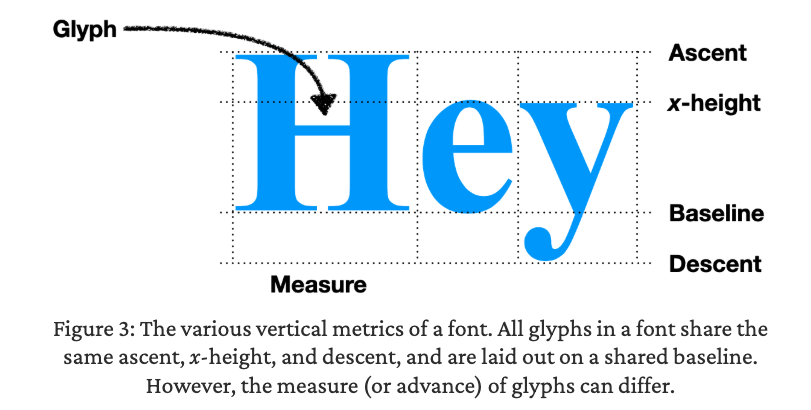
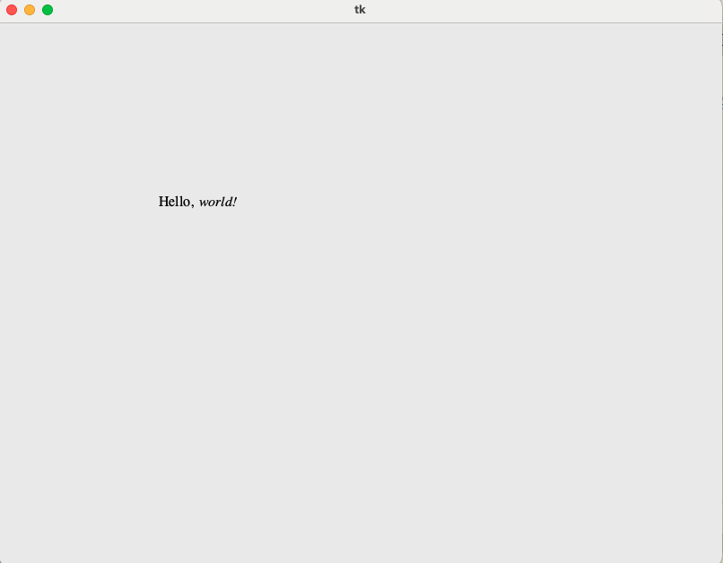
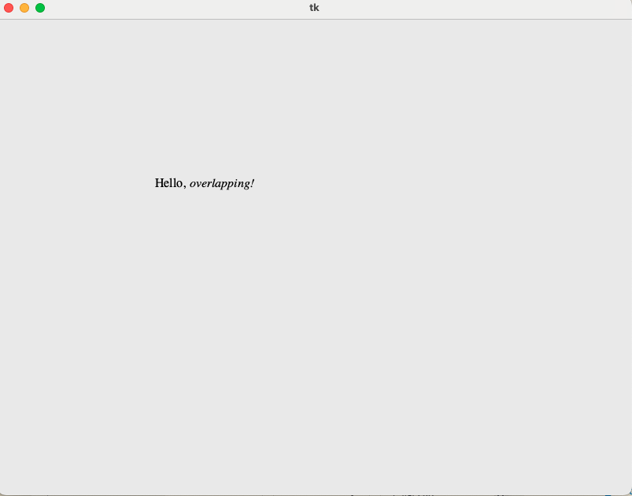

# 3장. 텍스트 포맷팅하기

## 3.1 폰트(서체)란?

텍스트를 화면에 그리는 것까지는 완료했지만, 폰트, 크기, 색상을 지정하지는 않았다. 이를 위해서는 **폰트 객체**를 만들고 사용해야 한다.

### 폰트란 무엇일까?

폰트란 단어는 옛날 금속 활자로부터 유래되었다. 활자들을 별도의 상자에 모았는데, 그 활자 케이스들의 집합을 폰트라 불렀다.

오늘날의 폰트는 글꼴, 서체(typeface), 타입을 의미한다. 다음과 같은 값들을 가진다.

- **글자 두께(weight)** : 굵게(bold), 기본 두께(normal) 등
- **스타일** : 이탤릭체, 로마체 등
- **크기**

### 폰트 객체

Tk의 폰트 객체는 다음과 같다. 고정된 크기, 스타일, 글자 두께와 같은 정보를 가지고 있다.

```python
import tkinter.font

window = tkinter.Tk()
bi_times = tkinter.font.Font(
	family="Times",
	size=16,
  weight="bold",
  slant="italic",
)
```

이렇게 만들어진 폰트 객체는 `create_text`의 `font` 인수로 전달할 수 있다.

```python
canvas.create_text(200, 100, text="Hello?", font=bi_times)
```

## 3.2 텍스트 측정하기

텍스트 역시 요소이므로 가로세로 공간을 차지한다. 이 대 텍스트가 차지하는 공간을 폰트 객체의 `metrics`와 `measure` 메서드를 이용해 측정할 수 있다.

```python
>>> bi_times.metrics()
{'ascent': 15, 'descent': 4, 'linespace': 19, 'fixed': 0}
>>> bi_times.measure("Hi!")
24
```

### 폰트의 높이

`metrics()` 메서드는 폰트의 세로축에 대한 특성을 나타내는 **네 가지 정보를 반환**한다.

- **ascent (어센트)**: 기준선(baseline) 위의 텍스트 높이
- **descent (디센트)**: 기준선 아래의 텍스트 높이
- **linespace (라인 공간)**: 전체 텍스트의 높이
- **fixed (고정 폭 여부)**: 모든 문자가 동일한 수평 폭(`width`)을 가지는지 여부를 나타내는 **불리언 값** (0 또는 1)

크기가 다른 글자들이 같은 줄에 있을 때는 위 혹은 아래로 정렬하는 것이 아니라, 기준선으로 정렬해야 한다. 따라서 이럴 때는 ascent와 descent 값이 중요하다. 아래의 그림도, 각각의 글자들이 기준선 baseline을 기준으로 정렬되는 것을 볼 수 있다.



폰트의 크기를 16으로 통일해도 각 스타일별로 메트릭들이 다른 것을 볼 수 있다. 폰트 객체를 생성할 때 지정하는 `size`는 **포인트(points)** 단위이며, 이는 모니터의 픽셀과는 다른 개념이라 실제 문자의 픽셀 높이를 의미하지는 않는다. 실제로는 폰트의 크기가 글자 자체의 크기가 아닌, 글자를 조각한 금속 블록의 크기라 한다.

```python
tkinter.font.Font(family="Courier", size=16).metrics()
# {'ascent': 13, 'descent': 4, 'linespace': 17, 'fixed': 1}
tkinter.font.Font(family="Times", size=16).metrics()
#{'ascent': 14, 'descent': 4, 'linespace': 18, 'fixed': 0}
tkinter.font.Font(family="Helvetica", size=16).metrics()
#{'ascent': 15, 'descent': 4, 'linespace': 19, 'fixed': 0}
```

### 폰트의 너비

`measure()` 메서드는 텍스트가 차지하는 가로 공간의 크기를 나타낸다. 당연히 글자마다 너비가 다르다.

```python
bi_times.measure("Hi!")
# 24
bi_times.measure("H")
# 13
bi_times.measure("i")
# 5
bi_times.measure("!")
# 7
```

### 텍스트 배치

이제 `metrics`과 `measure`를 사용하여 페이지에 텍스트를 배치할 수 있다.

```python
import tkinter.font

window = tkinter.Tk()

canvas = tkinter.Canvas(window, width=800, height=600)
canvas.pack()

font1 = tkinter.font.Font(family="Times", size=16)
font2 = tkinter.font.Font(family="Times", size=16, slant="italic")

x, y = 200, 200
canvas.create_text(x, y, text="Hello, ", font=font1)

# measure를 사용하여
x += font1.measure("Hello, ")
canvas.create_text(x, y, text="overlapping!", font=font2)

window.mainloop()
```

하지만 `create_text`의 x와 y 좌표는 텍스트의 중심을 가리키기 때문에, 텍스트의 너비가 길다면 겹치는 현상이 나타날 수 있다.



이를 해결하기 위해 `create_text`의 `anchor` 인수를 사용하여 좌표를 가지고 어떻게 텍스트를 배치할지를 정할 수 있다. `nw` 값을 사용하여 텍스트의 좌표를 좌상단 모서리로 처리할 수 있다.

```python
x, y = 200, 200
canvas.create_text(x, y, text="Hello, ", font=font1, anchor="nw")
x += font1.measure("Hello, ")
canvas.create_text(x, y, text="overlapping!", font=font2, anchor="nw")
```



## 3.3 한 단어씩 처리하기

중국어는 한 문자가 하나의 단어를 처리하므로 layout 함수에서 한 글자 단위로 루프를 반복해도 괜찮았다.

```python
def layout(text):
  #...
  for c in text:
    # 한 글자씩 반복
```

하지만 영어는 한 번에 한 단어씩 배치해야 하므로 단어 단위로 루프를 돌려야 한다.

```python
def layout(text):
  #...

	# 단어 단위로 루프
  for word in text.split():
    # 각 단어의 너비 계산
    w = font.measure(word)

    # 줄 바꿈 처리
    if cursor_x + w >= WIDTH - HSTEP:
      cursor_y += font.metrics("linespace") * 1.25 # 약간의 세로 여백을 위해 1.25 곱하기
      cursor_x = HSTEP

    # 지금 단어 기억 후 다음 단어로 이동
    display_list.append((cursor_x, cursor_y, word))
    cursor_x += w + font.measure(" ") # 단어 너비 + 공백 너비
```

## 3.4 텍스트에 스타일 주기

<b> 혹은 <i> 태그를 사용하여 텍스트를 굵게 표시하거나 이탤릭체로 표시하는 경우가 있다. 이런 태그들을 분석할 수 있도록 `lex`가 토큰 리스트를 반환하도록 변경해 보자.

이 때 토큰이란

- Text 객체 : 태그 밖의 문자열
- Tag 객체 : 태그의 내용

를 의미한다.

이를 위해 `Text`와 `Tag` 클래스를 작성한다.

```python
class Text:
  def __init__(self, text):
    self.text = text

class Tag:
  def __init__(self, tag):
    self.tag = tag
```

`lex`에서 텍스트를 `Text`와 `Tag` 객체로 수집하도록 한다.

```python
def lex(body):
  out = []
  buffer = ""
  in_tag = False
  for c in body:
    if c == "<":
      in_tag = True
      if buffer: out.append(Text(buffer))
      buffer = ""
    elif c == ">":
      in_tag = False
      out.append(Tag(buffer))
      buffer = ""
    elif not in_tag:
      buffer += c
  if not in_tag and buffer:
    out.append(Text(buffer))
  return out
```

이제 페이지의 텍스트뿐 아니라 그 안의 태그도 layout으로 전달이 가능해졌다. 따라서 layout은 텍스트가 아니라 토큰 단위로 루프를 돌면서 처리해야 한다.

```python
# tokens를 받는다
def layout(tokens):
  #...
  for tok in tokens:
    if isinstance(tok, Text): # 텍스트만 화면에 표시해야 함
      for word in tok.text.split():
        w = font.measure(word)
        if cursor_x + w >= WIDTH - HSTEP:
          cursor_y += font.metrics("linespace") * 1.25
          cursor_x = HSTEP
        display_list.append((cursor_x, cursor_y, word))
        cursor_x += w + font.measure(" ")
```

태그 토큰들을 확인하여 페이지에 적힌 태그에 따라 글꼴을 변경할 수 있음. 일단 가중치와 스타일을 변경하도록 두 가지 변수를 선언하자. 이런 변수들을 가지고 글꼴들을 선택할 수 있다.

```python
# 가중치와 스타일 기본값
weight = "normal"
style = "roman"

for tok in tokens:
    if isinstance(tok, Text): # 텍스트만 화면에 표시해야 함
	    for word in tok.text.split():
		    # 태그를 처리하여 텍스트에 글꼴 적용
		    font = tkinter.font.Font(
			    size=16,
			    weight=weight,
			    slant=style,
		    )
      #.... 텍스트 처리

    # 태그 처리
    elif tok.tag == "i":
      style = "italic"
    elif tok.tag == "/i":
      style = "roman"
    elif tok.tag == "b":
      weight = "bold"
    elif tok.tag == "/b":
      weight = "normal"
```

`layout`에서 폰트를 계산했다면 이를 `draw`에서 직접 그려야 한다. 지금은 디스플레이 리스트에 폰트 항목이 없으므로, 이를 추가해야 한다.

```python
		if isinstance(tok, Text): # 텍스트만 화면에 표시해야 함
      for word in tok.text.split():
        # ....
        display_list.append((cursor_x, cursor_y, word, font))
```

## 3.5 레이아웃 객체

### 레이아웃을 객체로 리팩토링하기

layout 함수 내에 많은 로컬 변수들과 복잡한 제어 흐름들이 추가되면서 점점 함수가 커지는 것을 알 수 있다. 이를 대응하기 위해서 함수에서 클래스로 변경할 수 있다.

```python
class Layout:
  def __init__(self, tokens):
    self.display_list = []

    # 로컬 변수들을 클래스의 필드로 변경
    self.cursor_x, self.cursor_y = HSTEP, VSTEP
    self.weight = "normal"
    self.style = "roman"
```

토큰에 대한 루프도 `Layout`의 메서드로 옮긴다.

```python
class Layout:
  def __init__(self, tokens):
    #...
    for tok in tokens:
      self.token(tok)

  # 토큰 처리 로직
  def token(self, tok):
    if isinstance(tok, Text):
      for word in tok.text.split():
        self.word(word)
    elif tok.tag == "i":
      self.style = "italic"
    elif tok.tag == "/i":
      self.style = "roman"
    elif tok.tag == "b":
      self.weight = "bold"
    elif tok.tag == "/b":
      self.weight = "normal"

	# 단어들을 display list에 추가
  def word(self, word):
    font = tkinter.font.Font(
      size=16,
      weight=self.weight,
      slant=self.style,
    )
    w = font.measure(word)

    if self.cursor_x + w >= WIDTH - HSTEP:
      self.cursor_y += font.metrics("linespace") * 1.25
      self.cursor_x = HSTEP

    self.display_list.append((self.cursor_x, self.cursor_y, word))
    self.cursor_x += w + font.measure(" ")
```

이제 `Browser`에서 레이아웃 로직을 호출하는 부분도 변경한다.

```python
class Browser:
  def load(self, url):
    body = url.request()
    tokens = lex(body)
    self.display_list = Layout(tokens).display_list
    self.draw()
```

### 폰트의 크기 변경을 추가하기

CSS의 font-size 속성을 사용해서 폰트의 크기를 다루는 것이 가장 좋겠지만, 아직 CSS를 구현하지 않았기 때문에 일단 `<small>`과 `<big>` 태그를 사용하여 폰트의 크기를 변경해 보자.

```python
class Layout:
  def __init__(self, tokens):
    #...
    self.size = 12

  def word(self, word):
    font = tkinter.font.Font(
      size=self.size, # 추가
      weight=self.weight,
      slant=self.style,
    )

  def token(self, tok):
    #...
    elif tok.tag == "small":
      self.size -= 2
    elif tok.tag == "/small":
      self.size += 2
    elif tok.tag == "big":
      self.size += 4
    elif tok.tag == "/big":
      self.size -= 4
```
